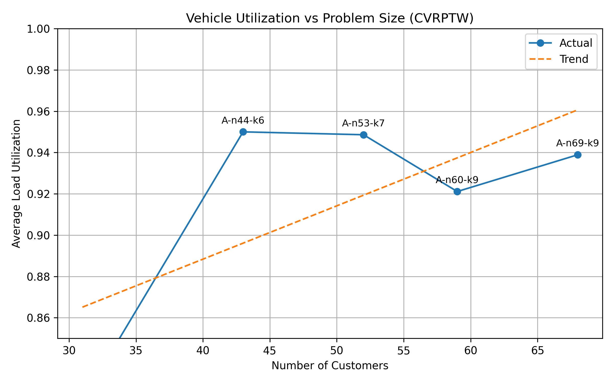

#  Intelligent Last-Mile Logistics Optimization System (CVRPTW)

##  Project Overview

This project develops an intelligent optimization system for last-mile delivery based on the **Capacitated Vehicle Routing Problem with Time Windows (CVRPTW)**.

The goal is to design efficient delivery routes that:

- Minimize total travel distance
- Satisfy vehicle capacity constraints
- Respect customer delivery time windows
- Maximize vehicle utilization

The system is implemented using **Python + OR-Tools**, and evaluated on multiple benchmark datasets with varying problem sizes.

---

##  Problem Description

In last-mile logistics, companies must decide:

- How to assign customers to vehicles
- How to construct delivery routes
- While respecting:
  - Vehicle capacity constraints
  - Customer time window constraints
  - Operational time limits

This problem is modeled as:

> **CVRPTW (Capacitated Vehicle Routing Problem with Time Windows)**

---

##  Methodology

### 1️⃣ Data Processing

- Parsed standard CVRP benchmark datasets (A-n32-k5, A-n44-k6, etc.)
- Converted raw `.vrp` files into structured tables:
  - `nodes.csv`
  - `depot.csv`
  - `meta.json`

---

### 2️⃣ Time Window Generation

Since benchmark datasets do not include time constraints, realistic delivery time windows were generated based on customer distance:

- Near customers → early time window
- Mid-distance customers → mid-day window
- Far customers → late delivery window

Each customer is assigned:

- `ready_time`
- `due_time`
- `service_time`

---

### 3️⃣ Optimization Model

The routing problem is solved using **Google OR-Tools**:

- Objective: Minimize total routing distance
- Constraints:
  - Vehicle capacity
  - Time windows
  - Service time
  - Depot working time

Key components:

- Distance matrix (Euclidean)
- Time dimension (travel time + service time)
- Capacity dimension
- Guided local search optimization

---

### 4️⃣ Batch Experiment Framework

A batch pipeline was built to:

- Run multiple benchmark instances
- Automatically save results:
  - `solution.json`
  - `metrics.csv`
- Generate summary tables across instances

---

##  Experimental Results

Experiments were conducted on multiple instances with **32 to 69 customers**.

###  Key Metrics

- Total routing distance
- Number of vehicles used
- Average load utilization
- Distance per customer

---

##  Routing Efficiency vs Problem Size

**Insight:**

> The distance per customer generally decreases as problem size increases, indicating improved route consolidation efficiency at larger scales, despite minor fluctuations due to spatial distribution differences.

---

##  Vehicle Utilization vs Problem Size

**Insight:**

> The average vehicle utilization remains consistently above 90% across all problem sizes, demonstrating efficient capacity usage and well-balanced routing decisions.

---

##  Summary Table

| Instance | Customers | Vehicles | Distance | Utilization |
|----------|----------|----------|----------|-------------|
| A-n32-k5 | 31 | 5 | 792 | ~0.95 |
| A-n44-k6 | 43 | 6 | 1004 | ~0.95 |
| A-n53-k7 | 52 | 7 | 1121 | ~0.94 |
| A-n60-k9 | 59 | 9 | 1492 | ~0.92 |
| A-n69-k9 | 68 | 9 | 1267 | ~0.94 |

---

##  Key Findings

-  **Scalability**: The model handles increasing problem sizes effectively
-  **Efficiency**: Distance per customer decreases with scale
-  **High Utilization**: Vehicle utilization consistently exceeds 90%
-  **Balanced Routing**: Load distribution across vehicles is well-optimized

---

##  Technical Highlights

- CVRP → CVRPTW extension with realistic constraints
- End-to-end pipeline: raw data → optimization → evaluation → visualization
- Multi-instance experiment framework
- Operational metrics for logistics decision-making

---

##  Tech Stack

- Python
- OR-Tools
- Pandas
- NumPy
- Matplotlib

---

##  How to Run

### 1️⃣ Data Processing

### 1️⃣ Data Processing

- Parsed standard CVRP benchmark datasets (A-n32-k5, A-n44-k6, etc.)
- Converted raw `.vrp` files into structured tables:
  - `nodes.csv`
  - `depot.csv`
  - `meta.json`

---

### 2️⃣ Time Window Generation

Since benchmark datasets do not include time constraints, realistic delivery time windows were generated based on customer distance:

- Near customers → early time window
- Mid-distance customers → mid-day window
- Far customers → late delivery window

Each customer is assigned:

- `ready_time`
- `due_time`
- `service_time`

---

### 3️⃣ Optimization Model

The routing problem is solved using **Google OR-Tools**:

- Objective: Minimize total routing distance
- Constraints:
  - Vehicle capacity
  - Time windows
  - Service time
  - Depot working time

Key components:

- Distance matrix (Euclidean)
- Time dimension (travel time + service time)
- Capacity dimension
- Guided local search optimization

---

### 4️⃣ Batch Experiment Framework

A batch pipeline was built to:

- Run multiple benchmark instances
- Automatically save results:
  - `solution.json`
  - `metrics.csv`
- Generate summary tables across instances

---

##  Experimental Results

Experiments were conducted on multiple instances with **32 to 69 customers**.

### 🔹 Key Metrics

- Total routing distance
- Number of vehicles used
- Average load utilization
- Distance per customer

---

##  Routing Efficiency vs Problem Size

**Insight:**

> The distance per customer generally decreases as problem size increases, indicating improved route consolidation efficiency at larger scales, despite minor fluctuations due to spatial distribution differences.

---

##  Vehicle Utilization vs Problem Size

**Insight:**

> The average vehicle utilization remains consistently above 90% across all problem sizes, demonstrating efficient capacity usage and well-balanced routing decisions.

---
 Summary Table

| Instance | Customers | Vehicles | Distance | Utilization |
|----------|----------|----------|----------|-------------|
| A-n32-k5 | 31 | 5 | 792 | ~0.95 |
| A-n44-k6 | 43 | 6 | 1004 | ~0.95 |
| A-n53-k7 | 52 | 7 | 1121 | ~0.94 |
| A-n60-k9 | 59 | 9 | 1492 | ~0.92 |
| A-n69-k9 | 68 | 9 | 1267 | ~0.94 |

---

##  Key Findings

-  **Scalability**: The model handles increasing problem sizes effectively
-  **Efficiency**: Distance per customer decreases with scale
-  **High Utilization**: Vehicle utilization consistently exceeds 90%
-  **Balanced Routing**: Load distribution across vehicles is well-optimized

---

##  Technical Highlights

- CVRP → CVRPTW extension with realistic constraints
- End-to-end pipeline: raw data → optimization → evaluation → visualization
- Multi-instance experiment framework
- Operational metrics for logistics decision-making

---

##  Tech Stack

- Python
- OR-Tools
- Pandas
- NumPy
- Matplotlib

---

##  How to Run

### 1️⃣ Preprocess Data

bash
python scripts/preprocess_all.py

### 2️⃣ Generate Time Windows
bash
python scripts/time_window_generator.py

### 3️⃣ Run Optimization (Single Instance)
bash
python src/ortools_solver_tw.py
### 4️⃣Run Batch Experiments
bash
python -m scripts.run_cvrptw_batch
### 5️⃣ Generate Plots
bash
python scripts/plot_cvrptw_summary.py
python scripts/plot_utilization.py